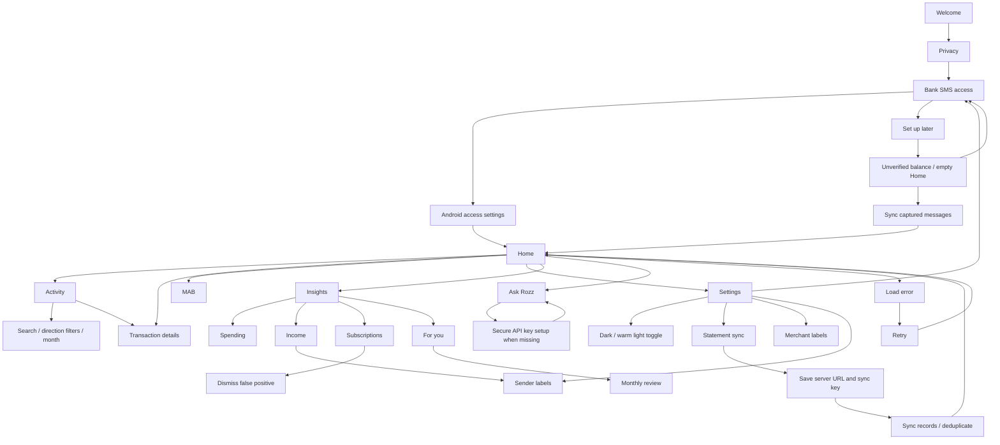

# ROZZ screen direction, 9 October 2026

Status: image concepts for review. The user requested images first, then Flutter implementation after the images are finalized. No app dependencies or UI code have been changed in this phase.

## Direction

Charcoal canvas, pastel panels, warm cream light mode. Mint identifies balance and income, butter yellow identifies MAB, blush identifies spending, lilac identifies computed insights. Soft lime identifies selection and primary actions. Dark ink on pastel surfaces in both modes. Color is supported by labels and icons. Syne-style headings, DM Sans body, tabular financial numbers. 24px screen gutters, generous vertical spacing, 48px tap targets, rounded panels and a five-destination dock.

References: the user's five attached inspiration images. Use their color blocks, soft shapes, financial hierarchy and quiet rows. ROZZ remains an SMS-based personal finance tracker; payment and transfer affordances from banking references are outside its current capabilities.

## Flow

The five main destinations retain the existing order: Home, Activity, Rozz, Insights, MAB. Settings is a header action. Details, configuration and management screens use back navigation. Goals is an optional future concept because the current Goals page uses static examples.

## Image coverage

25 individual images: Home dark/light, Activity dark/light, transaction detail, MAB dark/light, four Insights tabs, Chat, API key setup, monthly review, Settings dark/light, statement sync, merchant labels, sender labels, three onboarding screens, first-sync empty state, error recovery and optional Goals concept.

Light-mode images establish the shared theme on Home, Activity, MAB and Settings. Other screens currently have dark-mode images; their full light counterparts will follow any visual revisions before implementation. These images are visual proposals, not editable Flutter screens or proof of working functionality.

## Product truth

- All names, amounts and account suffixes are fictional demonstration content. Never replace them with private user data in public artifacts.
- Available balance requires a bank anchor; unknown balance does not display zero.
- MAB and streak use recorded bank balances; the denominator is recorded days. Sparse data must remain explicit.
- Insights and subscriptions are calculated from ledger data. False positive subscriptions can be dismissed.
- Narration displays the most detailed available source; today the shown detail is SMS.
- Privacy copy must acknowledge redacted AI requests and optional statement sync. Do not claim nothing leaves the phone.
- A stored key is masked. OS access prompts and device-security dialogs remain native.

## Review criteria

Review visual direction, density, typography, pastel proportions and navigation first. Generated charts and exact glyph spacing must be verified and recreated from actual computed data in implementation. The images are not final financial specifications. Keep unknown, empty, loading, offline and error states clear. Validate implementation at narrow widths, larger text sizes and both themes.

## Next phase after image finalization

Implement semantic theme tokens with a persistent BLoC theme preference, shared panel/list/navigation components, then apply the approved designs screen by screen. Keep existing domain calculations and ingest pipeline. Review each screen in a component gallery and real app preview, then run appropriate Flutter checks. No app code or dependencies are changed during image review.
